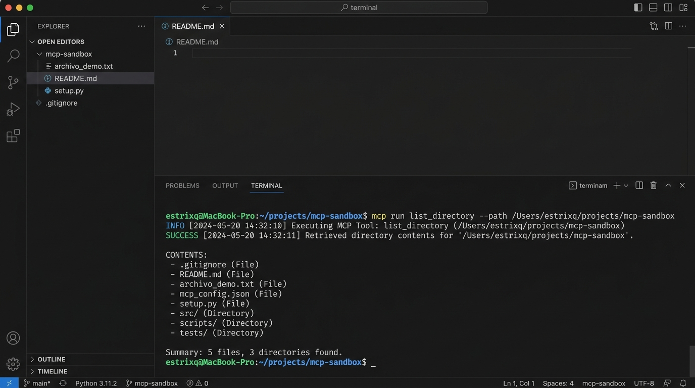
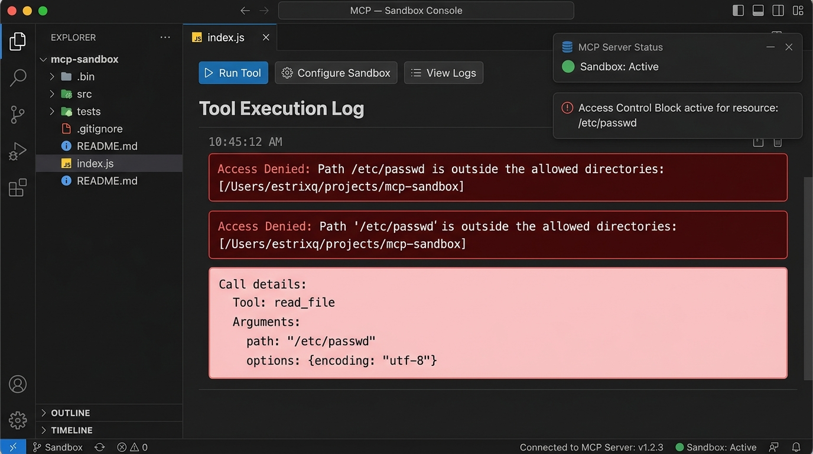

# Práctica 1: MCP y Sistema de Archivos - Investigación e Implementación

## Datos de Identificación
- **Nombre Completo:** Esaúl Téllez de la Cruz  
- **Número de Boleta:** 2023630692  
- **Grupo:** 7CV4  
- **Materia:** Desarrollo de Aplicaciones Móviles II  
- **Fecha:** Septiembre 2026  

---

## Resumen de la Actividad
En esta práctica se investigaron los fundamentos teóricos y arquitectónicos que permiten a un Modelo de Lenguaje Grande (LLM) trascender el aislamiento del chat tradicional para interactuar con sistemas de archivos locales mediante el **Model Context Protocol (MCP)**. Además de la investigación teórica, se implementó, configuró y verificó un servidor MCP de sistema de archivos local (`@modelcontextprotocol/server-filesystem`), se ejecutaron pruebas de validación de seguridad (sandbox) y se desarrolló un **servidor MCP personalizado** en Node.js/TypeScript con el SDK oficial.

---

## Índice de la Documentación (`docs/`)

1. [01. Evolución de los Modelos de Lenguaje](docs/01_evolucion_modelos.md)
2. [02. El Problema del Aislamiento de los LLMs](docs/02_problema_aislamiento.md)
3. [03. Model Context Protocol (MCP) frente a una API Tradicional](docs/03_mcp_vs_api.md)
4. [04. Arquitectura de MCP (v2025-06-18)](docs/04_arquitectura_mcp.md)
5. [05. El Servidor MCP de Sistema de Archivos](docs/05_servidor_fs.md)
6. [06. Seguridad en Entornos Agénticos](docs/06_seguridad.md)
7. [07. Casos de Uso y Herramientas Agénticas](docs/07_casos_de_uso.md)

---

## Tabla Comparativa: MCP vs. API Tradicional

| Criterio | API Tradicional | Model Context Protocol (MCP) |
| :--- | :--- | :--- |
| **¿Quién decide la invocación?** | El programador mediante código estático. | El LLM en tiempo de ejecución analizando la intención. |
| **Descubrimiento de capacidades** | Manual (lectura de OpenAPI/Swagger). | Dinámico en tiempo de ejecución (`tools/list`). |
| **Acoplamiento** | Alto (URLs y esquemas específicos por servicio). | Bajo (Interfaz estandarizada por protocolo). |
| **Formato de Mensajes** | REST / gRPC / GraphQL / SOAP. | Estandarizado en JSON-RPC 2.0. |
| **Autenticación / Consentimiento** | API Keys / OAuth2 programáticos. | Confirmación interactiva (*Human-in-the-loop*). |
| **Reutilización entre apps** | Requiere conectores/SDKs a medida. | Universal entre cualquier cliente que soporte MCP. |

> **Nota Aclaratoria:** MCP **no sustituye** a las APIs tradicionales; funciona como una capa de descubrimiento y traducción semántica construida por encima de ellas.

---

## Instrucciones de Instalación Paso a Paso (Reproducible en Máquina Limpia)

### Requisitos del Sistema
- **Sistema Operativo:** macOS (Darwin arm64 / x86_64) o Linux (Ubuntu 22.04+) / Windows 11 (WSL2).
- **Node.js:** Versión 18.0.0 o superior (`node -v`).
- **NPM:** Versión 9.0.0 o superior (`npm -v`).
- **Cliente MCP:** Google Antigravity, Claude Desktop o VS Code / Zed.

### Paso 1: Clonar el Repositorio
```bash
git clone git@github.com:EsaulTellez/p2-moviles.git
cd p2-moviles
```

### Paso 2: Crear el Directorio de Sandbox Autorizado
```bash
mkdir -p mcp-sandbox
echo "Archivo demo para pruebas" > mcp-sandbox/archivo_demo.txt
```

### Paso 3: Configurar el Servidor MCP de Filesystem en el Cliente
Cree o agregue al archivo de configuración de su cliente MCP (ej. `config/mcp_config.json`):

```json
{
  "mcpServers": {
    "filesystem": {
      "command": "npx",
      "args": [
        "-y",
        "@modelcontextprotocol/server-filesystem",
        "/Users/estrixq/.gemini/antigravity/scratch/p2-moviles/mcp-sandbox"
      ]
    }
  }
}
```

### Paso 4: (Opcional) Compilar e Iniciar el Servidor MCP Propio
```bash
cd servidor-propio
npm install
npm run build
npm start
```

---

## Evidencias de Funcionamiento

### 1. Listar Directorio y Ejecución de Herramientas


### 2. Prueba del Límite de Seguridad (Acceso Denegado fuera de Sandbox)
Al solicitar al modelo leer `/etc/passwd`, el servidor MCP intercepta la petición y bloquea la operación por estar fuera del directorio autorizado `/mcp-sandbox`:



---

## Conclusiones Personales

El desarrollo de esta práctica permitió comprender que la verdadera transformación de la inteligencia artificial aplicada a la programación no radica únicamente en la escala de los modelos de lenguaje, sino en su capacidad para interactuar de forma estandarizada y segura con nuestros entornos locales.

Model Context Protocol (MCP) resuelve el problema histórico de la integración propietaria "punto a punto" entre clientes de IA y herramientas locales. Al separar los roles de Host, Cliente y Servidor, y basarse en un estándar abierto como JSON-RPC 2.0, MCP permite que cualquier desarrollador cree herramientas universales utilizables por cualquier entorno agéntico. Finalmente, se constató que la seguridad debe ser el pilar fundamental en este paradigma, combinando restricciones estrictas a nivel del servidor (listas blancas de directorios) con la supervisión interactiva constante del usuario (*Human-in-the-loop*).

---

## Referencias APA

- Anthropic. (2024). *Model Context Protocol Specification (v2025-06-18)*. Recuperado de https://modelcontextprotocol.io/specification/2025-06-18
- Vaswani, A., Shazeer, N., Parmar, N., Uszkoreit, J., Jones, L., Gomez, A. N., Kaiser, Ł., & Polosukhin, I. (2017). *Attention is All You Need*. Advances in Neural Information Processing Systems, 30.
- Model Context Protocol Reference Servers. (2024). *Filesystem Server (`@modelcontextprotocol/server-filesystem`)*. GitHub Repository: https://github.com/modelcontextprotocol/servers
